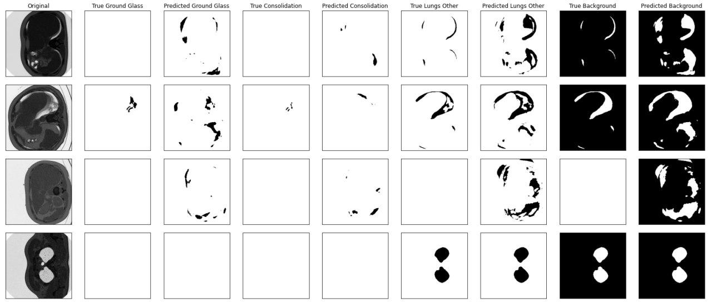

# Segmentation of COVID symptoms on CT scans
In this research, I try to apply different neural network architectures and fitting techniques to segment symptoms like Ground Glass and Consolidation on CT scans of lungs. 

I used [this](http://medicalsegmentation.com/covid19/) blogpost and [this](https://www.kaggle.com/c/covid-segmentation/overview) Kaggle competition as inspiration and data source.

## Results

The initial results I got fitting a Unet (see [first-network.ipynb](first-network.ipynb)):

|  Feature |              |
|----------|--------------|
| Epochs|41|
|Loss|9.028|
|Accuracy|0.9891|
|Ground Glass IoU|0.6709|
|Consolidation IoU|0.5052|
|Lungs Other IoU|0.9407|
|Background IoU|0.9946|

I tried to improve the results for the symptoms in two separate ways: experimenting with different data augmentations and network architectures. Both helped improve the value of different quality metrics (see detailed overview below). Interesting connections between the technique and the metric it helps to improve were found.

This is how segmentation looks:

### Augmentations

Simple augmentations:

|Augmentation|E|V{0.5}|V{0.5}S{1}|B{1}|G{1}[0.3]|G{1}[0.37]|
|----|----|-------|----------|---|--------|---------|
|Epochs|41|59|76|55|63|47|
|Loss|9.028|9.0246|9.0352|**9.0113**|9.0378|9.0527|
|Accuracy|0.9891|0.9896|0.9900|0.9892|**0.9902**|0.9901|
|Ground Glass IoU|0.6709|0.6958|**0.7208**|0.6366|0.7045|0.6970|
|Consolidation IoU|0.5052|0.4556|0.5659|0.5645|0.4967|**0.5707**|
|Lungs Other IoU|0.9407|0.9435|0.9441|0.9406|**0.9467**|0.9343|
|Background IoU|0.9946|0.9948|0.9945|0.9948|**0.9950**|0.9949|

Augmentation combinations:

|Augmentation|E|M|C1|C2|C3|
|----|----|----|----|----|----|
|Epochs|41|47|56|105|71|
|Loss|9.028|**9.0113**|9.0492|*9.0134*|9.0273|
|Accuracy|0.9891|**0.99021**|0.9896|*0.99018*|0.9900|
|Ground Glass IoU|0.6709|**0.7208**|0.6955|0.7086|*0.7097*|
|Consolidation IoU|0.5052|**0.5707**|0.5114|0.5568|*0.5604*|
|Lungs Other IoU|0.9407|**0.9467**|0.9415|*0.9455*|0.9453|
|Background IoU|0.9946|0.9950|0.9943|**_0.9952_**|0.9947|

Notable facts:

- Each simple augmentation massively improves metric for one class.
- Different coefficients may improve recognition of different classes (compare G[0.3] and G[0.37], C2 and C3)
- Combinations improve metrics for all classes, but not that massively (compare with M column)
- Each augmentation contributes its strengths to a combination (compare C2 and C3)

Augmentations legend (see [albumentations](https://albumentations.ai/) library for additional reference):

- _E_: identity augmentation
- _V{p}_ - vertical flip {probability}
- _S{p}_ - shift (max. 10%) scale (max. 10%) rotate (max. 15 degrees) {probability}
- _B{p}_ - random brightness (max. 10%) and contrast (max. 10%) {probability}
- _G{p}[d]_ - grid distortion [distortion coefficient] {probability}
- _M_ - maximum value for each feature of all simple augmentations researched
- _C1_ - _V{0.5}B{1}(S{0.5}|G{0.5}[0.3]){0.5}_
- _C2_ - _V{0.5}B{0.5}(S{0.5}|G{0.5}[0.3]){0.3}_
- _C3_ - _V{0.5}B{0.5}(S{0.5}|G{0.5}[0.37]){0.3}_

### Architectures

|Architecture|Unet|Unet++|MAnet|Deeplab|Deeplab+|
|---|---|---|---|---|---|
|Epochs|41|27|38|56|53|
|Loss|**9.0280**|9.1174|9.0372|9.0482|9.0268|
|Accuracy|**0.9891**|0.9864|0.9890|0.9859|0.9881|
|Ground Glass IoU|0.6709|0.5578|**0.6774**|0.6160|0.6609|
|Consolidation IoU|0.5052|0.0624|0.4523|0.4962|**0.5204**|
|Lungs Other IoU|**0.9407**|0.9233|0.9400|0.9215|0.9381|
|Background IoU|0.9946|0.9944|**0.9947**|0.9919|0.9942|

Notable facts:

- Unet shows quite good results despite being one of the simplest architectures. Unet-based networks also give better results compared to similar networks without Unet base (compare Deeplab and Deeplab+).
- Specific architecture features result in specific metric improvements (e. g. MAnet with its attention blocks: we see the focus on ground glass symptom).

## Repo Navigation

The code is in Python, inside Jupyter Notebook. To run the code yourself you'll need to download the data from kaggle competition, putting it into the `raw-data-kaggle` folder. I'd recommend to use Google Colab with GPU, as it has good enough hardware and most of the needed dependencies installed. Time to fit the network on Google Colab is approximately 30 minutes.

Notebook contents:

1. `data-visualisation` - initial look at the data
2. `first-network` - fitting the default Unet
3. `augmentations` - going over different augmentations
4. `architectures` - going over different architectures

The notebooks contain some similar parts that are updated and improved in newer notebooks (`augmentations` and `architectures`), so if you want to borrow some code, I recommend to use the last two notebooks :)

To read more information on the research, check out [report](report.pdf) and [presentation](presentation.pdf) (russian only, unfortunately).

